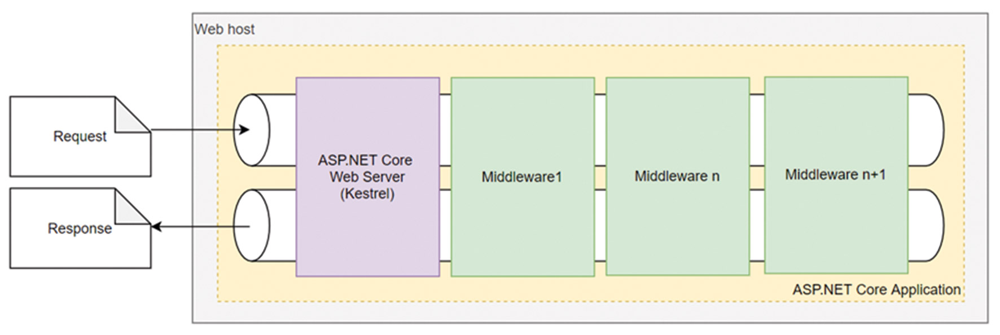
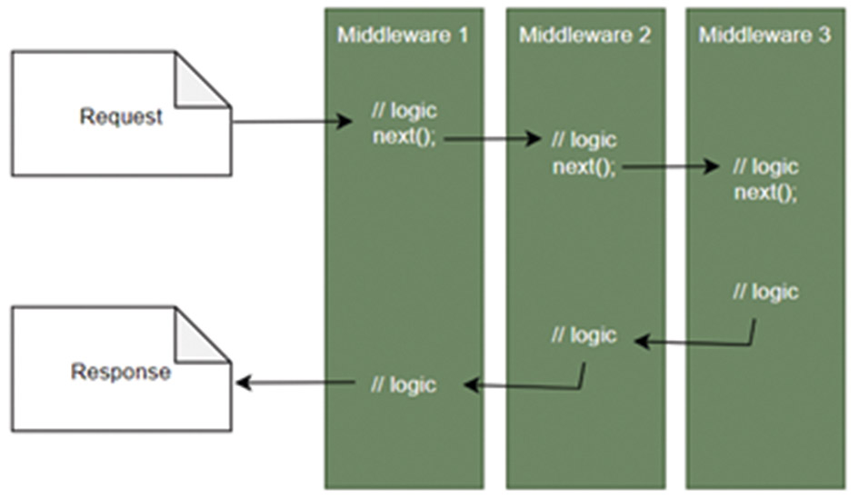
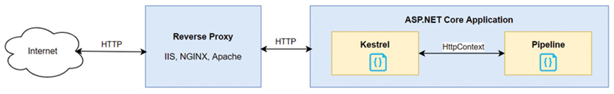
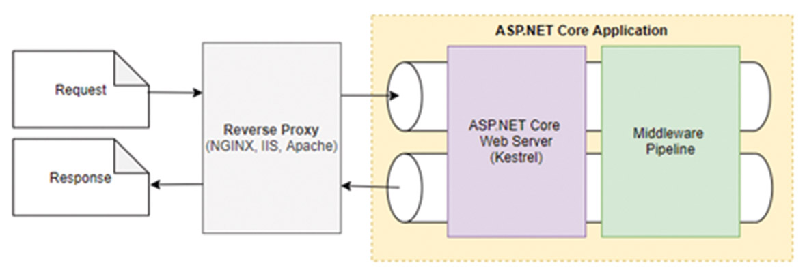
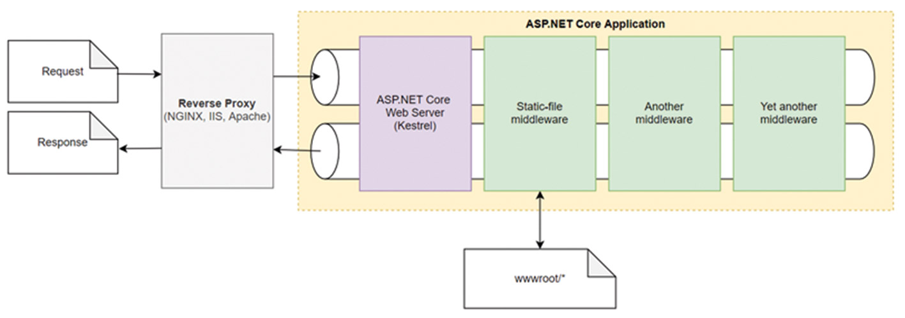
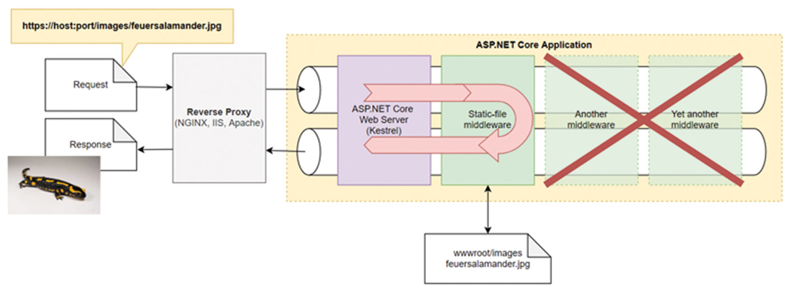

# ASP.NET-Core: Vorbereitungen für die Middleware

Jeder, der eine Webanwendung mit ASP.NET Core schreibt, verwendet bewusst oder unbewusst mindestens eine sogenannte Middlewarekomponente. Aber was genau ist eigentlich eine Middleware und wie funktioniert sie? Und weshalb sollte ich selbst eine schreiben wollen? Diese Artikelserie zeigt auf, was Middlewarekomponenten eigentlich sind, wie sie funktionieren und wie man selbst eine entwickelt. Ebenso wird die Testbarkeit beleuchtet und anhand eines Anschauungsbeispiels erklärt.

Der Begriff „Middleware“ lässt sich nicht eindeutig definieren, da dieser in verschiedenen informationstechnischen Kontexten verwendet wird. Definiert man „Middleware“ aber im Kontext einer ASP.NET-Core-basierten Webanwendung, so handelt es sich dabei um Komponenten, die Teil der anwendungsspezifischen HTTP Request/Response Pipeline sind (**Abb. 1**). Diese Pipeline wird von jedem HTTP Request durchlaufen, um eine HTTP Response zu erzeugen.

Abb. 1: HTTP Request/Response Pipeline

Jede Middleware hat dabei genau eine spezifische Aufgabe. Diese Aufgabe kann zum Beispiel im Ausliefern von statischen Dateien wie CSS und JavaScript bestehen, die vom Browser gelesen und interpretiert werden. Oder auch Aufgaben im Bereich der Authentifizierung und Autorisierung, Komprimieren von Daten, etc.

## Prinzip der eindeutigen Verantwortlichkeit – Single Responsibility Principle

Die ASP.NET Core Pipeline folgt in dieser Hinsicht dem Prinzip der eindeutigen Verantwortlichkeit (Single Responsibility Principle, SRP). Dieses besagt nach Robert C. Martin, dass ein Modul nur einem Akteur gegenüber verantwortlich sein sollte.

## Die HTTP Pipeline

Die Aneinanderreihung mehrerer Middlewarekomponenten wird dann zu einer Pipeline zusammengefasst, die von jedem HTTP Request in einer Sequenz durchlaufen wird. Die Verkettung wird dabei durch Delegates realisiert, die jeweils auf die nachfolgende Middlewarekomponente zeigen.

Abb. 2: Request/Response Pipeline gebildet durch Delegates

Wie in **Abbildung 2** zu erkennen ist, wird der HTTP Request von Middleware zu Middlewarekomponente gereicht, bis schließlich eine HTTP Response erzeugt und wieder über die Pipeline zurück an den Aufrufer gegeben wird.

## Der HttpContext

Der HTTP Request bzw. die HTTP Response wird dabei in ein Objekt vom Typ *HttpContext* gekapselt. Dieses Objekt beinhaltet, neben anderen Informationen, eine Liste der HTTP-Header sowie den Request und den Response Body. Jede Middleware kann sowohl den HTTP Request als auch die HTTP Response verändern und basierend auf dem Zustand des *HttpContext* Aktionen durchführen. Die Pipeline ist somit bidirektional.

Das *HttpContext*-Objekt wird von Kestrel erzeugt, dem ASP.NET-Core-Webserver. Dieser nimmt (i. d. R. von einem Reverse Proxy) die rohe Netzwerkanfrage entgegen, konstruiert daraus eine C#-Repräsentation (in Form des *HttpContext**)* und reicht sie an die Applikation- bzw. die Middleware-Pipeline weiter (**Abb. 3**).

Abb. 3: Reverse Proxy, Kestrel und der HttpContext

Wie bereits erwähnt stellt Kestrel eine HTTP-Server-implementierung dar, die standardmäßig von jedem ASP.NET-Core-Projekt verwendet wird. Dieser Server unterstützt HTTPS, HTTP/2 sowie Unix-Sockets für einen beschleunigten Informationsaustausch mit Reverse Proxies, wie z. B. NGINX.

Die Verwendung eines Reverse Proxy ist zwar nicht zwingend notwendig, wird aber für den Betrieb in einer produktiven Umgebung empfohlen. Der Grund dafür liegt in der Aufgabenteilung: Denn ein Reverse Proxy kann verschiedene Aufgaben übernehmen, die Kestrel nicht unterstützt. So z. B. das Caching von Inhalten, Beschleunigen von TLS, Firewalling oder auch Lastverteilung an mehreren dahinterliegenden Instanzen. Populäre Beispiele für Reverse Proxies sind NGINX, Apache und IIS (**Abb. 4**).

Abb. 4: Kestrel und die Middleware-Pipeline

Kestrel ist dagegen ein eher einfacher Webserver, der sich mit der Aufgabe begnügt, rohe Netzwerkanfragen entgegenzunehmen, diese in einen *HttpContext* zu transformieren und an die Anwendung zu übergeben.

## Middleware-Anschauungsbeispiel

Schauen wir uns nun die Abarbeitung eines HTTP Requests am Beispiel der *StaticFileMiddleware* an. Da es sich hierbei um eine verhältnismäßig einfache und integrierte Middleware handelt, eignet sie sich gut als Anschauungsbeispiel.

Wie der Name bereits verrät, besteht die Aufgabe dieser Middleware darin, statische Inhalte auszuliefern. In der Regel zählen zu diesen statischen Inhalten Cascading Stylesheets, JavaScript, Bilder und auch statische HTML-Seiten, die sich im Web-Root befinden *(**{content-root}/wwwroot*) (**Abb. 5**). Aber auch jedes andere Binärformat wie MP3 etc. könnte hier genannt werden.

Abb. 5: StaticFileMiddleware

Die *StaticFileMiddleware* reduziert den Ressourcenbedarf (CPU, Memory, IOPS) einer ASP.NET-Core-Anwendung, indem sie statische Inhalte ausliefert, ohne dabei die nachgelagerten Middlewarekomponenten zu involvieren. Sie erfüllt diese Aufgabe, indem sie bei einem URL-Match die Pipeline kurzschließt und die angeforderte Ressource direkt zurückliefert, ohne dass der HTTP Request dabei die nachfolgenden Middleware-komponenten durchlaufen müsste. Das wird in **Abbildung 6** verdeutlicht. Fordert beispielsweise ein Anwender ein Bild an, das in ein HTML-Dokument eingebettet ist, wird dieses von der Middleware direkt ausgeliefert und die Pipeline kurzgeschlossen. Wird hingegen ein Dokument angefordert, das nicht von der *StaticMiddleware* aufgelöst werden kann, so wird die Anfrage an die nachfolgende Middlewarekomponente weitergereicht.

Abb. 6: Kurzgeschlossene Pipeline verhindert die Ausführung nachfolgender Komponenten

Der Umstand, dass Middlewarekomponenten die Abarbeitung der Pipeline kurzschließen bzw. terminieren können, impliziert, dass die Reihenfolge, in der die einzelnen Middlewarekomponenten mit der Pipeline regis-triert werden, für die Anwendungslogik entscheidend ist.

So könnte die Auslieferung statischer Inhalte nur dann über HTTPS (statt HTTP) erzwungen werden, wenn die *HttpsRedirectionMiddleware* vor der *StaticFileMiddleware* in der Pipeline registriert wird. Andernfalls würde der Request die *HttpsRedirectionMiddleware* niemals erreichen.

## Wo und wie wird Middleware konfiguriert?

Den Kern jeder ASP.NET-Core-Anwendung stellt der sog. Host dar (definiert durch das Interface *IHost*). Dieser wird beim Starten der Anwendung erzeugt und beinhaltet die HTTP-Serverimplementierung (Kestrel), Loggingfunktionalität, Depedency Injection Services sowie die Middleware-Pipeline.

Von ASP.NET Core 3.1 und 5.0 kennt man bereits zwei Hostingmodelle, den .NET Generic Host sowie den ASP.NET Core Web Host, wobei der Web Host nur noch für Spezialfälle benötigt wird, bei denen eine Rückwärtskompatibilität verlangt ist. Seit ASP.NET Core 6.0 ist mit der *WebApplication*-Klasse noch ein drittes Modell dazu gekommen. Nämlich das sog. Minimal Hosting Model, was eine vereinfachte Form des Generic Host darstellt:

```c#
public sealed class WebApplication : IHost, IDisposable, IApplicationBuilder, IEndpointRouteBuilder, IAsyncDisposable
```

Die Anzahl der implementierten Interfaces lässt erahnen, dass es sich dabei um einen komplexen Typ handelt, dessen manuelle Instanziierung sehr aufwendig wäre. Deshalb wird dieser Typ, den man zum Erzeugen und Starten einer Webapplikation benötigt, über einen Builder instanziiert (vgl. Builder Pattern):

```c#
var builder = WebApplication.CreateBuilder();
var app = builder.Builder();
// ...
app.Run()
```

Mit dem Generic Host wurden bisher Infrastruktur- und App-Konfigurationsaufgaben in zwei Dateien aufgeteilt (*Program.cs* und *Startup.cs*). Neuerdings befindet sich alles in einer Datei. Wem das zu unübersichtlich ist und wer sich mehr Struktur in seiner Anwendung wünscht, dem sei die Struktur aus Listing 1 empfohlen (nach Andrew Lock).

Listing 1

```c#
var builder = WebApplication.CreateBuilder(args);
 
ConfigureConfiguration(builder.Configuration);
ConfigureServices(builder.Services);
 
var app = builder.Build();
 
ConfigureMiddleware(app, app.Services);
ConfigureEndpoints(app, app.Services);
 
app.Run();
 
void ConfigureConfiguration(ConfigurationManager configuration) {} 
void ConfigureServices(IServiceCollection services) {}
void ConfigureMiddleware(IApplicationBuilder app, IServiceProvider services) {}
void ConfigureEndpoints(IEndpointRouteBuilder app, IServiceProvider services) {}
```

Eine simple ASP.NET-Core-6.0-Anwendung, die die *StaticFileMiddleware* konfiguriert, zeigt Listing 2. Hierbei wird ein an den Pfad */* gerichteter HTTP Request mit „Hello World“ beantwortet. Der Aufruf von *MapGet()* definiert bereits eine terminierende Middleware, die die Pipeline kurzschließt und eine Antwort zurückliefert. Die *StaticFileMiddleware* wird für eine Anfrage an den URL */* also nie aufgerufen. Sollte der URL davon abweichen, wird der *HttpContext* an die *StaticFileMiddleware* weitergereicht, die mit Hilfe der Extension-Methode *UseStaticFiles()* der Pipeline hinzugefügt wurde.

Listing 2

```c#
var builder = WebApplication.CreateBuilder(args);
var app = builder.Build();
 
ConfigureMiddleware(app, app.Services);
 
app.Run();
 
void ConfigureMiddleware(IApplicationBuilder app, IServiceProvider services) 
{
  app.MapGet("/", () => "Hello World");
  app.UseStaticFiles()
}
```

Neben der *StaticFileMiddleware* stellt ASP.NET Core eine Reihe weiterer integrierter Middlewarekomponenten bereit. So zum Beispiel die HSTS-Middleware für eine bessere Netzwerksicherheit, die *ResponseCompressionMiddleware* für Datenkompression und viele mehr. So unterschiedlich die Aufgaben der einzelnen Middlewarekomponenten auch sein mögen, eins haben sie gemeinsam: Sie lassen sich alle über Extension-Methoden der Pipeline hinzufügen, die der Namenskonvention *Use** folgen:

```c#
public static IApplicationBuilder UseStaticFiles(this IApplicationBuilder app)
{
  // ...
  return app.UseMiddleware<StaticFileMiddleware>();
}
```

## Registrieren von Middleware am DI-Container

Nun mag einem auffallen, dass zur Konfiguration der *StaticFileMiddleware* keine explizite Registrierung der Klasse *StaticFileMiddleware* mit dem DI-Container notwendig ist. Der Grund liegt in dem Umstand, dass die *StaticFileMiddleware* eine sogenannte konventionsfolgende Middleware ist, die über Introspektion (Reflection) beim Starten der Anwendung instanziiert wird.

Den konventionsfolgenden Middlewarekomponenten stehen die fabrikmustererzeugten Middlewareklassen gegenüber, die das Interface *IMiddleware* implementieren und explizit mit dem DI-Container registriert werden müssen.

Das Interface *IHost* schreibt das Property *IServiceProvider* *services* vor, das von der Klasse *WebApplication* implementiert wird. Hierüber können Services (und eben auch fabrikmustererzeugte Middlewareklassen) im DI-Container registriert werden (Listing 3). Die Methode *UseMiddleware<TMiddlware>()* fügt diese schlussendlich der Pipeline hinzu.

Listing 3: Registrieren einer Middleware

```c#
var builder = WebApplication.CreateBuilder(args);
ConfigureServices(builder.Services);
 
var app = builder.Build();
ConfigureMiddleware(app, app.Services);
 
app.Run();
 
void ConfigureServices(IServiceCollection services) 
{
  services.AddScoped<MyMiddleware>();
}
void ConfigureMiddleware(IApplicationBuilder app, IServiceProvider services) 
{
  app.MapGet("/", () => "Hello World");
  app.UseMiddleware<MyMiddleware>();
}
```

## Fazit

Wie wir gesehen haben, stellt die HTTP Pipeline eine Verkettung von Delegates dar, die den einzelnen Middlewarekomponenten entsprechen. Sie transportieren, modifizieren und bearbeiten den HTTP-Kontext, der wiederum von Kestrel aus einer unbearbeiteten Netzwerkanfrage erzeugt wird.

Des Weiteren haben wir gesehen, dass die Reihenfolge, in der Middlewarekomponenten registriert werden, für die Abarbeitungslogik von Bedeutung ist. Auch wurde aufgezeigt, dass jede Middleware darüber entscheiden kann, ob das nachfolgende Delegate aufgerufen oder die Pipeline terminiert werden soll (Kurzschluss). Abschließend wurde gezeigt, dass die sogenannten konventionsfolgenden Middlewarekomponenten nicht explizit am DI-Container registriert werden müssen.