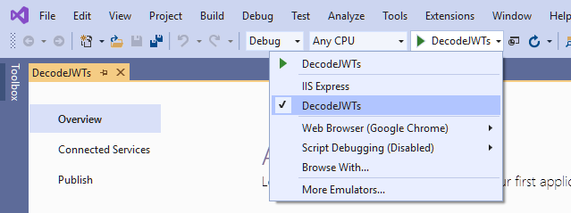

# Decode JWTs in C# for Authorization

There are two main steps in securing an application: authentication and authorization. Authentication is easy enough. A user enters a username and password (maybe even a second factor) to prove (authenticate) who they are. Authorization is a little less cut and dried. There are lots of factors that go into what an authenticated user is authorized to do. First, you need some information about the user that just authenticated.

Many modern web apps use JSON Web Tokens (JWTs) during the authentication process. These JWTs can also carry information that can be used for authorization decisions within your applications. In this tutorial, you will learn how to decode JWTs in C# and how to use information from a JWT to make authorization decisions in a .NET Core app.

## [TL;DR - How to Decode JWTs in C#](https://developer.okta.com/blog/2019/06/26/decode-jwt-in-csharp-for-authorization#tldr---how-to-decode-jwts-in-c)

If you already have a JWT and you just want to know how to decode it in C#, here is the code you need:

```c#
var jwt = "(the JTW here)";
var handler = new JwtSecurityTokenHandler();
var token = handler.ReadJwtToken(jwt);

// now do something with token.Claims, token.Audiences, etc.
```

Note that the code above just reads the information from the JWT. It *does not validate the JWT* to ensure that it hasn’t been forged or tampered with.

If you’re using OpenID Connect, there is actually a better way to access the information in the JWTs used in the authentication process, so read on!

## [Clone the JWT C# Project](https://developer.okta.com/blog/2019/06/26/decode-jwt-in-csharp-for-authorization#clone-the-jwt-c-project)

To get started, clone or download [the starter project](https://github.com/oktadeveloper/csharp-decode-jwt-example) from GitHub, and open the solution in Visual Studio 2019.

Next, click on the down arrow near the green start button and change startup action from **IIS Express** to **DecodeJWTs**.



Now when you run the project, it will use the Kestrel web server instead of IIS Express. Before you run the project you will need to add some configuration settings from Okta, which you will do in a moment.

## [Set up an Authorization Server to Generate JWTs](https://developer.okta.com/blog/2019/06/26/decode-jwt-in-csharp-for-authorization#set-up-an-authorization-server-to-generate-jwts)

While you could invent your own security system using JWTs, that would probably be *a very bad idea*. Security systems are complex, and there are many opportunities to get something wrong. So for this tutorial, you will use OpenID Connect for authentication so you won’t need to worry about generating and validating JWTs. You will just learn how to decode and use the JWTs that are used in the OpenID authentication handshake.

Before you begin, you’ll need a free Okta developer account. Install the [Okta CLI](https://cli.okta.com/) and run `okta register` to sign up for a new account. If you already have an account, run `okta login`. Then, run `okta apps create`. Select the default app name, or change it as you see fit. Choose **Web** and press **Enter**.

Select **Other**. Then, change the Redirect URI to `https://localhost:5001/authorization-code/callback` and use `https://localhost:5001/signout-callback-oidc` for the Logout Redirect URI.

<details style="box-sizing: border-box; display: block; color: rgb(93, 93, 93); font-family: proxima-nova, Helvetica, Arial, sans-serif; font-size: 16px; font-style: normal; font-variant-ligatures: normal; font-variant-caps: normal; font-weight: 400; letter-spacing: normal; orphans: 2; text-align: start; text-indent: 0px; text-transform: none; white-space: normal; widows: 2; word-spacing: 0px; -webkit-text-stroke-width: 0px; background-color: rgb(255, 255, 255); text-decoration-thickness: initial; text-decoration-style: initial; text-decoration-color: initial;"><summary style="box-sizing: border-box; cursor: pointer;">What does the Okta CLI do?</summary><p style="box-sizing: border-box; margin: 20px 0px;"></p><div class="language-shell highlighter-rouge" style="box-sizing: border-box;"><div class="highlight" style="box-sizing: border-box;"><pre class="highlight" style="box-sizing: border-box; overflow: auto; font-family: monospace, monospace; font-size: 1em; margin: 20px 0px; display: block; white-space: pre-wrap; padding: 15px; background: rgb(244, 244, 244); color: rgb(61, 61, 61);"><code style="box-sizing: border-box; font-family: monospace, monospace; font-size: 1em; display: inline-block; white-space: pre; background: none; padding: 0px;"></code></pre></div></div><p style="box-sizing: border-box; margin: 20px 0px;"><code class="language-plaintext highlighter-rouge" style="box-sizing: border-box; font-family: monospace, monospace; font-size: 1em; display: inline-block; white-space: pre; padding: 0px 5px; background: rgb(244, 244, 244); line-height: 24px;"></code><code class="language-plaintext highlighter-rouge" style="box-sizing: border-box; font-family: monospace, monospace; font-size: 1em; display: inline-block; white-space: pre; padding: 0px 5px; background: rgb(244, 244, 244); line-height: 24px;"></code></p><div class="language-shell highlighter-rouge" style="box-sizing: border-box;"><div class="highlight" style="box-sizing: border-box;"><pre class="highlight" style="box-sizing: border-box; overflow: auto; font-family: monospace, monospace; font-size: 1em; margin: 20px 0px; display: block; white-space: pre-wrap; padding: 15px; background: rgb(244, 244, 244); color: rgb(61, 61, 61);"><code style="box-sizing: border-box; font-family: monospace, monospace; font-size: 1em; display: inline-block; white-space: pre; background: none; padding: 0px;"><span class="nb" style="box-sizing: border-box; color: rgb(17, 93, 139);"></span><span class="nv" style="box-sizing: border-box; color: rgb(17, 93, 139);"></span><span class="o" style="box-sizing: border-box; color: rgb(61, 61, 61);"></span><span class="s2" style="box-sizing: border-box; color: rgb(226, 40, 102);"></span><span class="nb" style="box-sizing: border-box; color: rgb(17, 93, 139);"></span><span class="nv" style="box-sizing: border-box; color: rgb(17, 93, 139);"></span><span class="o" style="box-sizing: border-box; color: rgb(61, 61, 61);"></span><span class="s2" style="box-sizing: border-box; color: rgb(226, 40, 102);"></span><span class="nb" style="box-sizing: border-box; color: rgb(17, 93, 139);"></span><span class="nv" style="box-sizing: border-box; color: rgb(17, 93, 139);"></span><span class="o" style="box-sizing: border-box; color: rgb(61, 61, 61);"></span><span class="s2" style="box-sizing: border-box; color: rgb(226, 40, 102);"></span></code></pre></div></div><p style="box-sizing: border-box; margin: 20px 0px;"><code class="language-plaintext highlighter-rouge" style="box-sizing: border-box; font-family: monospace, monospace; font-size: 1em; display: inline-block; white-space: pre; padding: 0px 5px; background: rgb(244, 244, 244); line-height: 24px;"></code></p><p style="box-sizing: border-box; margin: 20px 0px 0px;"><strong style="box-sizing: border-box; font-weight: 600;"></strong><a href="https://developer.okta.com/docs/guides/sign-into-web-app/-/create-okta-application/" style="box-sizing: border-box; background-color: transparent; color: rgb(22, 98, 221); transition: color 0.4s ease 0s; text-decoration: none;"></a></p></details>

Add your Okta domain, client ID, and client secret to your `appsettings.json` file, like this:

```json
"Okta": {
  "ClientId": "{OktaClientId}",
  "ClientSecret": "{OktaClientSecret}",
  "OktaDomain": "https://{yourOktaDomain}"
}
```

(Note that in order to keep these secrets out of source control you should move the `ClientId` and `ClientSecret` settings to your **User Secrets** file before you commit. You can skip this step for now since this is just a tutorial.)

Now run your project and make sure that you can sign in and out.

## [Review the OpenID Connect Authentication Middleware](https://developer.okta.com/blog/2019/06/26/decode-jwt-in-csharp-for-authorization#review-the-openid-connect-authentication-middleware)

Okta has some custom middleware that makes adding OpenID Connect authentication to your application really easy. But for this application, you will use the generic OpenID Connect middleware that comes with .NET Core so you can directly access the JWTs that are used in the authentication process.

In your `Startup.cs` file, you will see the configuration for the OpenID Connect middleware:

```c#
JwtSecurityTokenHandler.DefaultInboundClaimTypeMap.Clear();

services.AddAuthentication(options =>
{
    options.DefaultAuthenticateScheme = CookieAuthenticationDefaults.AuthenticationScheme;
    options.DefaultSignInScheme = CookieAuthenticationDefaults.AuthenticationScheme;
    options.DefaultChallengeScheme = "OpenIdConnect";
})
.AddCookie()
.AddOpenIdConnect(options =>
{
    options.ClientId = Configuration.GetValue<string>("Okta:ClientId");
    options.ClientSecret = Configuration.GetValue<string>("Okta:ClientSecret");
    options.Authority = $"{Configuration.GetValue<string>("Okta:OktaDomain")}/oauth2/default";
    options.CallbackPath = "/authorization-code/callback";
    options.ResponseType = "code";
    options.SaveTokens = true;
    options.UseTokenLifetime = false;
    options.GetClaimsFromUserInfoEndpoint = true;
    options.Scope.Add("openid");
    options.Scope.Add("profile");
    options.Scope.Add("email");

    options.TokenValidationParameters = new TokenValidationParameters
    {
      NameClaimType = "name",
      RoleClaimType = "role"
    };

    options.Events = new OpenIdConnectEvents()
    {
      OnUserInformationReceived = context =>
      {
        string rawAccessToken = context.ProtocolMessage.AccessToken;
        string rawIdToken = context.ProtocolMessage.IdToken;
        var handler = new JwtSecurityTokenHandler();
        var accessToken = handler.ReadJwtToken(rawAccessToken);
        var idToken = handler.ReadJwtToken(rawIdToken);

        // do something with the JWTs

        return Task.CompletedTask;
      },
    };
});
```

The code above configures your application to use Okta as an identity provider, using the settings you specified in `appsettings.json`. You will also notice some code that intercepts and decodes the two JWTs provided by Okta’s authorization server during the authentication process. The access token is always provided. It only contains essential information that identifies the user and grants access. Because you specified `options.GetClaimsFromUserInfoEndpoint = true;`, an identity token is also requested. This token will contain any additional information (claims) about the user that has been requested. In the example above, we requested the `profile` and `email` scopes, so the `idToken.Claims` collection will contain information such as the name and email address of the authenticated user.

## [Use Information in JWT for Authorization in C#](https://developer.okta.com/blog/2019/06/26/decode-jwt-in-csharp-for-authorization#use-information-in-jwt-for-authorization-in-c)

Now you’ll extract some information from the id token that you can use for authorization decisions.

You already learned how to decode the id token in the `OnUserInformationReceived` event of the OpenID Connect middleware. I have some good news for you. You don’t actually need to decode the JWT yourself because the middleware automatically decodes the id token and uses the information in it to populate the authenticated user’s claims.

If you set a breakpoint in the `OnUserInformationReceived` event and examine `idToken.Claims` and `context.Principal.Claims`, you will see that both properties contain a list of the exact same claims.

So how can you use the claims that are automatically extracted from the id token to make authorization decisions? I will share an example.

## [Assign User to Roles in C# Based on JWT Claims](https://developer.okta.com/blog/2019/06/26/decode-jwt-in-csharp-for-authorization#assign-user-to-roles-in-c-based-on-jwt-claims)

Suppose you have a simple application that just has a couple of admin users which can be hard-coded into your application. In the `OnUserInformationReceived` event you could check if the authenticated user is one of the admins, and if so, assign the user to the `Admin` role, like this:

At the top of `Startup.cs` add

```c#
using System.Security.Claims;
```

Then replace the `OnUserInformationReceived` event with this code:

```c#
OnUserInformationReceived = context =>
{
    var admins = new string[]
    {
        "admin@company.com",
        "{your email address here}"
    };

    var additionalClaims = new List<Claim>();
    if (admins.Contains(context.Principal.FindFirstValue("email")))
    {
        additionalClaims.Add(new Claim("role", "Admin"));
    }

    var newIdentity = new ClaimsIdentity(context.Principal.Identity, additionalClaims, "pwd", "name", "role");
    context.Principal = new ClaimsPrincipal(newIdentity);

    return Task.CompletedTask;
},
```

In the code above you check to see if the user’s email address (that was provided in the JWT because we requested the `email` scope from the authorization server) is in the list of admins. If so, we recreate the `ClaimsPrincipal`, adding an additional claim for the Admin role.

The `HomeController` should already have an `Admin` method that is decorated with an `[Authorize(Roles = "Admin")]` attribute. Run the app and if you are signed in, sign out and sign in again to re-run the authentication middleware and create a new cookie. After that try to access the Admin page. If your email address is in the list of admins, you should be able to access the page. Otherwise, access should be denied.

Another way that you could use claims that are populated from a JWT for authorization decisions would be to write a custom authorization policy that contains custom authorization logic based on the information in `context.User.Claims`. I will leave that exercise for you.