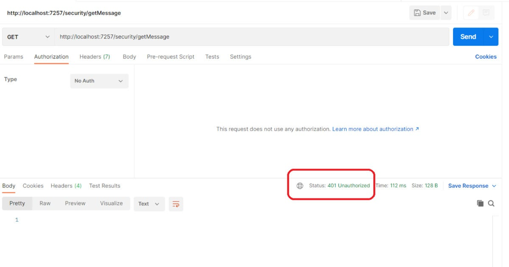
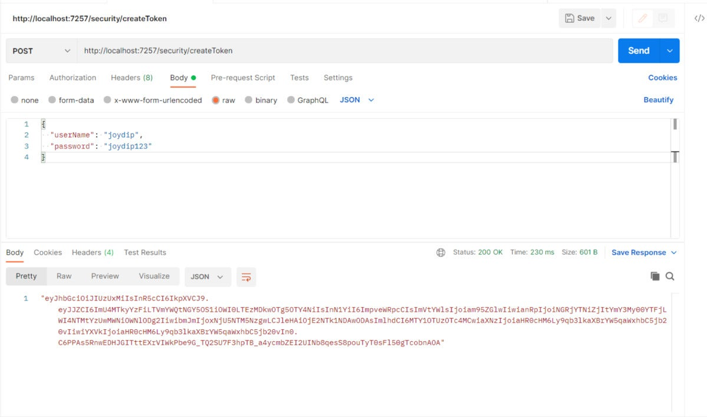
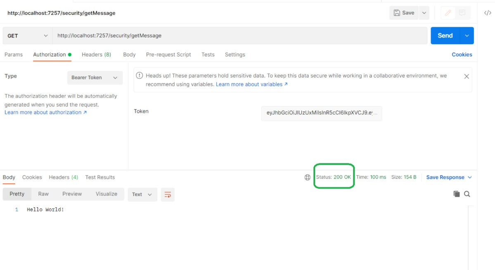

# How to implement JWT authentication in ASP.NET Core 6

### It’s easy to secure minimal API endpoints in ASP.NET Core 6 using JSON Web Tokens for authentication and authorization. Just follow these steps.

ASP.NET Core 6 introduces a simplified hosting model that allows us to build lightweight APIs with minimal dependencies. Naturally, you will often need to secure the endpoints of such APIs in your applications. The goal of this post is to give you a head start on doing so.

We have discussed [how to get started with minimal APIs](https://www.infoworld.com/article/3645148/how-to-use-the-minimal-hosting-model-in-aspnet-core-6.html), [how to use logging and dependency injection in minimal APIs](https://www.infoworld.com/article/3662294/use-logging-and-di-in-minimal-apis-in-aspnet-core-6.html), and [how to test minimal APIs](https://www.infoworld.com/article/3668174/how-to-test-minimal-apis-in-asp-net-core-6.html) in earlier articles. This article discusses how we can secure our minimal API endpoints using JWT authentication—i.e., authentication based on JSON Web Tokens.

To secure a minimal API using JWT authentication, we will follow these steps:

1. Create a minimal API project in Visual Studio 2022.
2. Create an API endpoint in the Program.cs file.
3. Add the Microsoft.AspNetCore.Authentication.JwtBearer NuGet package to our project.
4. Implement JWT authentication in the Program.cs file.
5. Create a user model class named User to store the login credentials of the user.
6. Specify a secret key in the appsettings.json file.
7. Specify JWT authentication settings in the Program.cs file.
8. Add authorization services middleware to our application in the Program.cs file.
9. Create and validate the JSON Web Token in the Program.cs file.

Note that all of the code examples shown in this post, except the User model class, should be part of Program.cs. The User model class should be part of the User.cs file.

## Create an ASP.NET Core 6 minimal Web API project in Visual Studio 2022

First off, let’s create an ASP.NET Core 6 project in Visual Studio. Following these steps will create a new ASP.NET Core 6 Web API project in Visual Studio 2022:

1. Launch the Visual Studio 2022 IDE.
2. Click on “Create new project.”
3. In the “Create new project” window, select “ASP.NET Core Web API” from the list of templates displayed.
4. Click Next.
5. In the “Configure your new project” window, specify the name and location for the new project.
6. Optionally check the “Place solution and project in the same directory” check box, depending on your preferences.
7. Click Next.
8. In the “Additional Information” window shown next, uncheck the check box that says “Use controllers…” since we’ll be using minimal APIs in this example. Leave the “Authentication Type” as “None” (default).
9. Ensure that the check boxes “Enable Docker,” “Configure for HTTPS,” and “Enable Open API Support” are unchecked as we won’t be using any of those features here.
10. Click Create.

We’ll use this ASP.NET Core 6 Web API project to create a minimal API endpoint and implement JWT authentication for it in the subsequent sections of this article.

## Create a HTTP Get endpoint in ASP.NET Core 6

When you create a new minimal Web API project in Visual Studio 2022, a Program.cs file will be created with a few lines of default code. You can replace the default code with the following code snippet to keep things simple and still provide a way to test your API.

```c#
var builder = WebApplication.CreateBuilder(args);
var app = builder.Build();
app.MapGet("/security/getMessage",
() => "Hello World!").RequireAuthorization();
app.Run();
```

Note the use of the RequireAuthorization extension method here. This helps you protect your routes using authorization policies and forces you to provide authentication information when calling this endpoint. The authorization middleware will use this information to validate the request for the current execution context.

If you execute this endpoint without this information, you’ll encounter a HTTP 401 Unauthorized error as shown in Figure 1.

[](https://images.idgesg.net/images/article/2022/08/secure-minimal-api-01-100930963-orig.jpg?auto=webp&quality=85,70)

Figure 1. An HTTP 401 Unauthorized error will be generated if authorization is required and no authorization information is provided.

## Install the JwtBearer NuGet package

Now add the Microsoft.AspNetCore.Authentication.JwtBearer NuGet package to your project. To do this, select the project in the Solution Explorer window, then right-click and select “Manage NuGet Packages.” In the NuGet Package Manager window, search for the Microsoft.AspNetCore.Authentication.JwtBearer package and install it.

Alternatively, you can install the package via the NuGet Package Manager console by entering the command shown below.

```cmd
PM> Install-Package Microsoft.AspNetCore.Authentication.JwtBearer
```

## Specify a secret key in the appsettings.json file

Next, create a section in the appsettings.json file for the Issuer, Audience, and Key information. This information will be used later to generate a JSON Web Token. Note that you can give any name to this section you want; I’ll use the name “Jwt” for convenience. 

Add the following information in the appsettings.json file.

```json
"Jwt": {
  "Issuer": "https://joydipkanjilal.com/",
  "Audience": "https://joydipkanjilal.com/",
  "Key": "This is a sample secret key - please don't use in production environment.'"
}
```

## Specify authentication settings in the Program.cs file

The AddAuthenication method in the Program.cs file is used to configure JWT authentication at the time when the application starts. It specifies the authentication scheme as JwtBearer. Additionally the call to the AddJwtBearer method helps configure token parameters.

The Issuer, Audience, and Key values are read from the appsettings.json config file. The TokenValidationParameters instance is used to indicate if the Issuer, Audience, Key, and Lifetime information should be validated or not.

```c#
builder.Services.AddAuthentication(options =>
{
    options.DefaultAuthenticateScheme = JwtBearerDefaults.AuthenticationScheme;
    options.DefaultChallengeScheme = JwtBearerDefaults.AuthenticationScheme;
    options.DefaultScheme = JwtBearerDefaults.AuthenticationScheme;
}).AddJwtBearer(o =>
{
    o.TokenValidationParameters = new TokenValidationParameters
    {
        ValidIssuer = builder.Configuration["Jwt:Issuer"],
        ValidAudience = builder.Configuration["Jwt:Audience"],
        IssuerSigningKey = new SymmetricSecurityKey
        (Encoding.UTF8.GetBytes(builder.Configuration["Jwt:Key"])),
        ValidateIssuer = true,
        ValidateAudience = true,
        ValidateLifetime = false,
        ValidateIssuerSigningKey = true
    };
});
```

To add authorization services to your application, your Program.cs should also include the following code snippet.

```c#
builder.Services.AddAuthorization();
```

Your Program.cs should also include the following methods to enable authentication and authorization capabilities.

```c#
app.UseAuthentication();
app.UseAuthorization();
```

## Create a user model in ASP.NET Core 6

We will need a class to store the login credentials of the user or users. Create a class named User in a file having the same name with a .cs extension. Then insert the following code.

```c#
public class User
{
    public string UserName { get; set; }
    public string Password { get; set; }
}
```

This class will be used to accept user credentials as input.

## Create an endpoint to generate JSON Web Tokens

Lastly, we need to write the necessary code to generate and validate the JWTs we’ll use to authorize calls to the API. Once a token is generated in response to an initial request to the API, you can copy it and use it for authorization in all subsequent requests.

Now, write the following code in the Program.cs file to create a new HTTP Post endpoint that will create a JWT for an authenticated user.

```c#
app.MapPost("/security/createToken",
[AllowAnonymous] (User user) =>
{
    if (user.UserName == "joydip" && user.Password == "joydip123")
    {
        var issuer = builder.Configuration["Jwt:Issuer"];
        var audience = builder.Configuration["Jwt:Audience"];
        var key = Encoding.ASCII.GetBytes
        (builder.Configuration["Jwt:Key"]);
        var tokenDescriptor = new SecurityTokenDescriptor
        {
            Subject = new ClaimsIdentity(new[]
            {
                new Claim("Id", Guid.NewGuid().ToString()),
                new Claim(JwtRegisteredClaimNames.Sub, user.UserName),
                new Claim(JwtRegisteredClaimNames.Email, user.UserName),
                new Claim(JwtRegisteredClaimNames.Jti,
                Guid.NewGuid().ToString())
             }),
            Expires = DateTime.UtcNow.AddMinutes(5),
            Issuer = issuer,
            Audience = audience,
            SigningCredentials = new SigningCredentials
            (new SymmetricSecurityKey(key),
            SecurityAlgorithms.HmacSha512Signature)
        };
        var tokenHandler = new JwtSecurityTokenHandler();
        var token = tokenHandler.CreateToken(tokenDescriptor);
        var jwtToken = tokenHandler.WriteToken(token);
        var stringToken = tokenHandler.WriteToken(token);
        return Results.Ok(stringToken);
    }
    return Results.Unauthorized();
});
```

An instance of the User class is used to accept a user name and a password passed to this endpoint. Note the AllowAnonymous attribute. This is used to specify that we don’t need an authorization check in this endpoint. The Issuer, Audience, and Key are read from the configuration file. Each of these is used to create the token, which we have specified will expire in five minutes.

## The complete source code for Program.cs

Here is the complete source code of the Program.cs file for your reference.

```c#
using Microsoft.AspNetCore.Authentication.JwtBearer;
using Microsoft.AspNetCore.Authorization;
using Microsoft.IdentityModel.Tokens;
using System.IdentityModel.Tokens.Jwt;
using System.Security.Claims;
using System.Text;
var builder = WebApplication.CreateBuilder(args);
builder.Services.AddAuthentication(options =>
{
    options.DefaultAuthenticateScheme = JwtBearerDefaults.AuthenticationScheme;
    options.DefaultChallengeScheme = JwtBearerDefaults.AuthenticationScheme;
    options.DefaultScheme = JwtBearerDefaults.AuthenticationScheme;
}).AddJwtBearer(o =>
{
    o.TokenValidationParameters = new TokenValidationParameters
    {
        ValidIssuer = builder.Configuration["Jwt:Issuer"],
        ValidAudience = builder.Configuration["Jwt:Audience"],
        IssuerSigningKey = new SymmetricSecurityKey
            (Encoding.UTF8.GetBytes(builder.Configuration["Jwt:Key"])),
        ValidateIssuer = true,
        ValidateAudience = true,
        ValidateLifetime = false,
        ValidateIssuerSigningKey = true
    };
});
builder.Services.AddAuthorization();
var app = builder.Build();
app.UseHttpsRedirection();
app.MapGet("/security/getMessage", () => "Hello World!").RequireAuthorization();
app.MapPost("/security/createToken",
[AllowAnonymous] (User user) =>
{
    if (user.UserName == "joydip" && user.Password == "joydip123")
    {
        var issuer = builder.Configuration["Jwt:Issuer"];
        var audience = builder.Configuration["Jwt:Audience"];
        var key = Encoding.ASCII.GetBytes
        (builder.Configuration["Jwt:Key"]);
        var tokenDescriptor = new SecurityTokenDescriptor
        {
            Subject = new ClaimsIdentity(new[]
            {
                new Claim("Id", Guid.NewGuid().ToString()),
                new Claim(JwtRegisteredClaimNames.Sub, user.UserName),
                new Claim(JwtRegisteredClaimNames.Email, user.UserName),
                new Claim(JwtRegisteredClaimNames.Jti,
                Guid.NewGuid().ToString())
             }),
            Expires = DateTime.UtcNow.AddMinutes(5),
            Issuer = issuer,
            Audience = audience,
            SigningCredentials = new SigningCredentials
            (new SymmetricSecurityKey(key),
            SecurityAlgorithms.HmacSha512Signature)
        };
        var tokenHandler = new JwtSecurityTokenHandler();
        var token = tokenHandler.CreateToken(tokenDescriptor);
        var jwtToken = tokenHandler.WriteToken(token);
        var stringToken = tokenHandler.WriteToken(token);
        return Results.Ok(stringToken);
    }
    return Results.Unauthorized();
});
app.UseAuthentication();
app.UseAuthorization();
app.Run();
```

## JWT authentication in action

When you post the user credentials to the createToken endpoint using Postman, you’ll be able to see the generated token.

[](https://images.idgesg.net/images/article/2022/08/secure-minimal-api-02-100931045-orig.jpg?auto=webp&quality=85,70)

Figure 2. The JWT is generated successfully.

Note that we’ve passed the user credentials, i.e., the user name and password, in the body of the request.

Now, call the HTTP Get endpoint we created earlier and pass the generated token as a bearer token in the request header. If your generated token is valid, you’ll see the message shown in Figure 3.

[](https://images.idgesg.net/images/article/2022/08/secure-minimal-api-03-100931044-orig.jpg?auto=webp&quality=85,70)

Figure 3. The HTTP Get endpoint returns the text message in the response.

As you can see in Figure 3, the text message “Hello World!” is displayed because the token we passed is valid. Note the HTTP 200 OK response as well (highlighted in a green rectangle).

In this example, we hardcoded the user name and password to keep things simple. Of course, you should never hardcode user credentials in a production environment. A good choice is to use ASP.NET Core 6 Identity to manage user accounts.

To test our minimal API implementation here, we’ve used [Postman](https://www.postman.com/), one of the most popular tools available today to test APIs. To test your minimal API endpoints, you could also use [Swagger](https://www.infoworld.com/article/3650668/implement-authorization-for-swagger-in-aspnet-core-6.html), a toolkit that makes it simple to provide a graphical representation of your API.